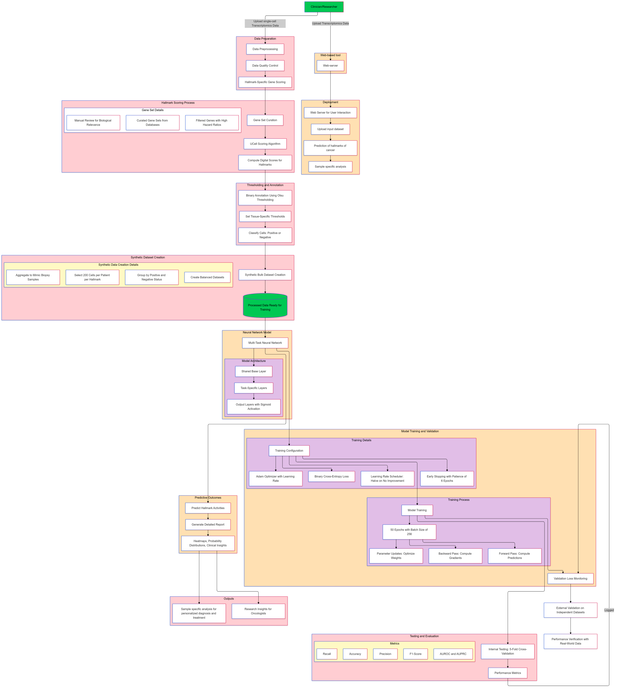

# OncoMark 🧬

[](https://www.nature.com/articles/s42003-025-08727-z)
[](https://doi.org/10.1038/s42003-025-08727-z)
[](https://pypi.org/project/OncoMark/)
[](https://github.com/SML-CompBio/OncoMark/blob/main/LICENSE)
[](https://oncomark.readthedocs.io/en/latest/)

> **A high-throughput neural multi-task learning framework for simultaneous quantification of all ten cancer hallmarks from transcriptomic data.**

Published in **Communications Biology (Nature Portfolio), 2025** — the first computational tool to predict all hallmarks of cancer concurrently from tumor biopsy transcriptomics.

---

## My Contribution

This repository documents my personal contribution to the OncoMark project, carried out during my research internship at the **S.N. Bose National Centre for Basic Sciences, Kolkata (2024–2025)** under Dr. Shubhasis Haldar.

**What I worked on:**

- End-to-end **data preprocessing pipeline**: raw scRNA-seq → quality-controlled → pseudo-bulk synthetic dataset construction
- **Feature engineering**: variance-based gene selection, rank-space transformation, z-score normalisation across 9,326 gene features
- **ML model benchmarking**: trained and evaluated logistic regression, SVM, random forest, XGBoost, and MLP baselines for comparative analysis against the multi-task neural network
- **External validation analysis**: applied trained OncoMark to 5 independent external cohorts; computed ROC-AUC, F1, precision-recall metrics
- **SHAP-based interpretability**: feature importance analysis across hallmark-specific output heads
- **Clinical staging analysis**: computed odds ratios linking predicted hallmark activities to AJCC/TNM staging across TCGA cohorts
- Contributed to **manuscript writing** and figure preparation

**Full project codebase:** [SML-CompBio/OncoMark](https://github.com/SML-CompBio/OncoMark)

---

## What is OncoMark?

Cancer progresses through ten fundamental biological capabilities — the **hallmarks of cancer** (Hanahan & Weinberg). While these hallmarks are well-established theoretically, no single tool existed to simultaneously quantify all ten from clinical transcriptomic data.

OncoMark bridges that gap:

| Hallmark | Abbreviation |
|---|---|
| Sustaining Proliferative Signaling | SPS |
| Evading Growth Suppressors | EGS |
| Resisting Cell Death | RCD |
| Enabling Replicative Immortality | ERI |
| Inducing Angiogenesis | IA |
| Activating Invasion and Metastasis | AIM |
| Deregulating Cellular Energetics | DCE |
| Avoiding Immune Destruction | AID |
| Genome Instability and Mutation | GIM |
| Tumor-Promoting Inflammation | TPI |

---

## Architecture

```
Input: Bulk RNA-seq gene expression (9,326 genes, rank-normalized)
         │
         ▼
┌─────────────────────────┐
│   Shared Backbone Layers │  ← learns pan-hallmark transcriptomic features
└────────────┬────────────┘
             │
    ┌────────┴────────┐
    │  10 Task-Specific│  ← one output head per hallmark
    │   Output Heads   │
    └────────┬────────┘
             │
Output: P(hallmark_i active) for i = 1..10  [values ∈ [0,1]]
```


**Training data:** Synthetic pseudo-bulk profiles from 3.1M single cells, 941 patients, 14 tumor types (Weizmann 3CA repository)

**Validation:** 5 external datasets + 8 gold-standard datasets (TCGA, CCLE, GTEx, ENCODE, MET500, POG570, PCAWG, TARGET)

---

## Key Results

| Metric | Internal CV (avg) | External Validation (min) |
|---|---|---|
| Accuracy | ≥ 98.73% | 96.6% |
| F1 Score | ≥ 97.99% | 93.46% |
| AUROC | ~1.00 | ≥ 0.97 |
| Balanced Accuracy | ≥ 98.74% | — |

- **SPS hallmark:** 100% accuracy, F1, and balanced accuracy
- **K-S test statistic > 0.7** (p ≈ 0) for all hallmarks distinguishing cancer vs. normal tissue
- Hallmark activity **significantly co-associates with AJCC Stages I → IV** and TNM staging

---

## Quickstart (Full Package)

```bash
pip install OncoMark
```

```python
import pandas as pd
from OncoMark import predict_hallmark_scores

# Input: DataFrame with genes as columns, samples as rows
input_data = pd.read_csv('your_rnaseq_data.csv', index_col=0)

# Predict all 10 hallmark activities simultaneously
predictions = predict_hallmark_scores(input_data)
print(predictions)
```

**Web server:** [oncomark-ai.hf.space](https://oncomark-ai.hf.space/) — no installation required

**Full documentation:** [oncomark.readthedocs.io](https://oncomark.readthedocs.io/en/latest/)

---

## Data Availability

| Dataset | Source |
|---|---|
| Synthetic training data (Dryad) | [doi.org/10.5061/dryad.zw3r228jc](https://doi.org/10.5061/dryad.zw3r228jc) |
| TCGA bulk RNA-seq | [gdac.broadinstitute.org](https://gdac.broadinstitute.org/) |
| GTEx normal tissue | [gtexportal.org](https://www.gtexportal.org/home/) |
| CCLE cell lines | [sites.broadinstitute.org/ccle](https://sites.broadinstitute.org/ccle/datasets) |
| Weizmann 3CA (scRNA-seq source) | [weizmann.ac.il/sites/3CA](https://www.weizmann.ac.il/sites/3CA/) |

*Note: Raw patient data is not included in this repository. Links to all public sources are provided above.*

---

## Citation

If you use OncoMark in your research, please cite:

```bibtex
@article{priyadarshi2025oncomark,
  title     = {OncoMark: a high-throughput neural multi-task learning framework
               for comprehensive cancer hallmark quantification},
  author    = {Priyadarshi, Shreyansh and Mazumder, Camellia and Neekhra, Bhavesh
               and Biswas, Sayan and Chowdhury, Debojyoti and Gupta, Debayan
               and Haldar, Shubhasis},
  journal   = {Communications Biology},
  volume    = {8},
  pages     = {1434},
  year      = {2025},
  publisher = {Nature Portfolio},
  doi       = {10.1038/s42003-025-08727-z}
}
```

---

## Related Links

| Resource | Link |
|---|---|
| 📄 Paper (Open Access) | [nature.com/articles/s42003-025-08727-z](https://www.nature.com/articles/s42003-025-08727-z) |
| 💻 Full Lab Repository | [github.com/SML-CompBio/OncoMark](https://github.com/SML-CompBio/OncoMark) |
| 🌐 Web Server | [oncomark-ai.hf.space](https://oncomark-ai.hf.space/) |
| 📦 PyPI Package | [pypi.org/project/OncoMark](https://pypi.org/project/OncoMark/) |
| 📚 Documentation | [oncomark.readthedocs.io](https://oncomark.readthedocs.io/en/latest/) |
| 🔬 S.N. Bose Lab | [SML-CompBio](https://github.com/SML-CompBio) |

---

## About Me

**Camellia Mazumder** — Computational Biologist & Data Scientist, Kolkata, India

[](https://www.linkedin.com/in/camellia-mazumder-7b79681b9/)
[](https://github.com/iamcamellia)
[](mailto:mazumder.camellia@gmail.com)
